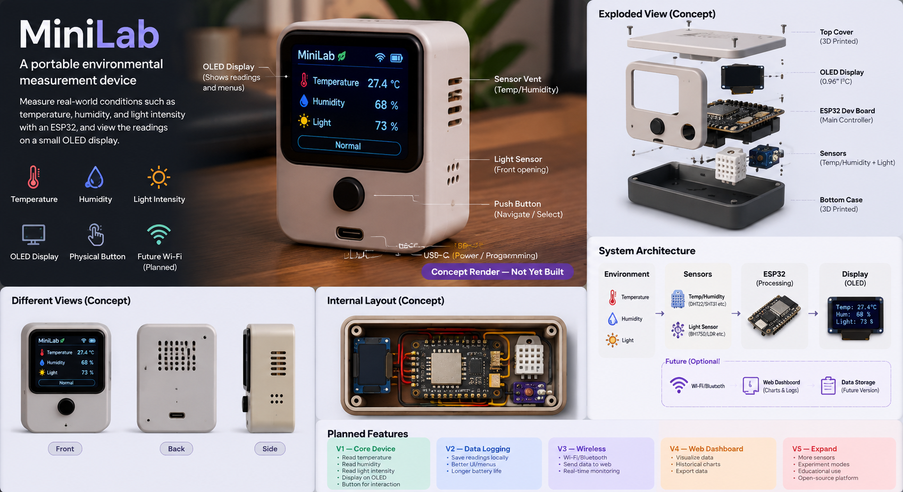
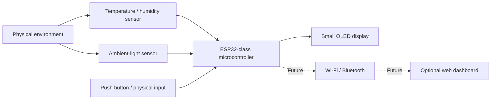

# MiniLab

MiniLab is a beginner-friendly, portable environmental and scientific measurement device. The initial concept combines an ESP32-class development board with temperature/humidity sensing, ambient-light sensing, a small OLED display, and at least one physical input.



*Concept render of the planned MiniLab V1. The device has not yet been physically built.*

## Project status

**Design / Planning**

MiniLab has not been physically built. No hardware has been purchased, assembled, tested, or validated yet. Component choices, electrical details, pin assignments, and the firmware framework remain to be confirmed.

## Motivation

MiniLab is intended as a first serious hardware project and a practical way to learn the complete beginner embedded-systems workflow. The goal is not only to make a gadget, but to understand how a small hardware product is researched, designed, prototyped, programmed, debugged, documented, and eventually enclosed.

## Learning objectives

- Work with a microcontroller and GPIO.
- Learn basic electronics, breadboarding, voltage, and power considerations.
- Connect sensors and a display using I2C and/or other appropriate interfaces.
- Write and debug small embedded programs.
- Organize firmware into understandable responsibilities.
- Produce a real schematic and bill of materials after choices are validated.
- Explore basic CAD and enclosure design.
- Test the system methodically and record the results.

## V1 goals

The first version is deliberately small:

- Read temperature and humidity.
- Read ambient light.
- Show measurements locally on a small OLED display.
- Include at least one physical button or other simple input.
- Use breadboard-friendly prototyping hardware.
- Work toward a simple enclosure design.

Data logging, wireless connectivity, web dashboards, authentication, databases, mobile applications, and AI are outside the V1 scope.

## High-level architecture



The diagram describes the current concept, not a validated circuit or completed build.

## Planned hardware

The current hardware concept consists of:

- An ESP32 development board.
- A temperature/humidity sensor.
- An ambient-light sensor.
- A small OLED display.
- A push button or comparable physical input.
- A breadboard and jumper wires for prototyping.
- Supporting resistors or other small components if the selected parts require them.
- Simple enclosure/prototyping material at a later stage.

The candidates and selection criteria are tracked in [BOM.md](BOM.md). No component is final until its electrical requirements, availability, documentation, and cost are checked.

## Software and firmware direction

Firmware will eventually initialize the hardware, read sensors, update the display, handle input, manage application state, and report or handle errors. The framework and language have not been selected yet. The main candidates are an Arduino framework with C++ or MicroPython; the trade-offs are documented in [firmware/README.md](firmware/README.md).

## Repository structure

```text
MiniLab/
├── README.md
├── BOM.md
├── ROADMAP.md
├── firmware/
│   └── README.md
├── hardware/
│   ├── README.md
│   └── schematic/
│       └── README.md
├── cad/
│   └── README.md
├── docs/
│   └── architecture.md
└── journal/
    └── README.md
```

Each document is intentionally useful at the planning stage; no placeholder schematic or fabricated test artifact is included.

## Roadmap summary

The work is currently in Phase 0: research and design. The planned sequence is to bring up the ESP32, validate one sensor, add the display and remaining input/sensor, integrate the firmware, explore an enclosure, and then test and document the result. See [ROADMAP.md](ROADMAP.md) for the phase checklist and future versions.

## Current limitations and open questions

- The hardware has not been built or validated.
- Final component models and prices are unknown.
- GPIO assignments, I2C addresses, pull-up requirements, and power details are unresolved.
- The firmware framework has not been chosen.
- No schematic, enclosure, measurements, test results, or hardware photos exist yet.
- The final design must remain within the approximate $30 parts target without treating that target as a confirmed quotation.

## Hack Club Half Life context

MiniLab is being prepared as a Tier 1 Hack Club Half Life hardware warm-up. The current planning constraints are an approximate $30 parts limit and approximately 10 hours of design effort. These constraints favor a small, beginner-friendly V1 and learning value over feature breadth. The bill of materials will remain provisional until candidate parts and prices are researched.

## License and contributions

No license has been selected yet. Until one is added, contributions and reuse should be discussed with the project owner before distributing project materials.
